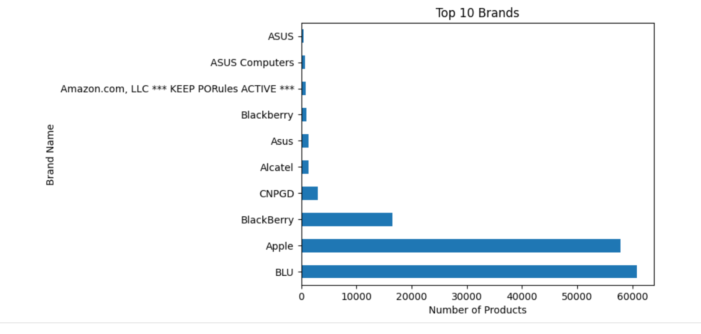

# 📱 Smart Product Recommender  
**A content-based recommendation system using NLP and TF-IDF vectorization**  

   

## 🌟 Overview  
This project builds a product recommendation engine that suggests similar unlocked mobile phones based on **customer reviews** (NLP) rather than traditional metadata. It demonstrates:  
- Real-world NLP preprocessing  
- TF-IDF vectorization  
- Cosine similarity for recommendations  
- End-to-end ML pipeline  

## 📊 Dataset  
**Source:** Amazon Reviews for Unlocked Mobile Phones  
**Key Features Used:**  
✔️ Product Name  
✔️ Brand  
✔️ Customer Reviews  
✔️ Star Ratings  

## ⚙️ Technical Implementation  
### Core Methodology  
1. **Text Cleaning**  
   - Removed duplicates/short reviews  
   - Handled missing values  
   - Standardized text formatting  

2. **TF-IDF Vectorization**  
   - Converted reviews to numerical features  
   - Optimized n-gram range (1-3)  

3. **Similarity Measurement**  
   - Cosine similarity between products  
   - Top-N recommendation logic  

### Tech Stack  
- **Python** + **Pandas**/NumPy (Data Processing)  
- **Scikit-learn** (TF-IDF, Cosine Similarity)  
- **Matplotlib**/Seaborn (Visualizations)  

## 🚀 Getting Started  
### Prerequisites  
- Python 3.8+  
- Libraries: `pandas numpy scikit-learn matplotlib seaborn`  

### Quick Start  
1. Download the dataset from [Kaggle](https://www.kaggle.com/datasets/...)  
2. Place `Amazon_Unlocked_Mobile.csv` in project root  
3. Run the Jupyter notebook  

## 📈 Sample Output  
**Input Product:**  
`Apple iPhone 5s Unlocked, 16GB - Gold`  

**Top 3 Recommendations:**  
1. iPhone 5s Unlocked, 16GB - Silver  
2. iPhone SE Unlocked, 32GB - Rose Gold  
3. Samsung Galaxy S4 Unlocked - Black  

## 🎨 Visualization Preview  
  
*Top 10 products*  

## 🔮 Future Enhancements  
- 🖥️ Streamlit/Gradio web interface  
- 🤝 Hybrid (Content + Collaborative) filtering  
- ☁️ AWS deployment  

## 👥 Author  
**Mauli Patel**  
  
📧 **Contact:** maulipatel18112003@gmail.com  
